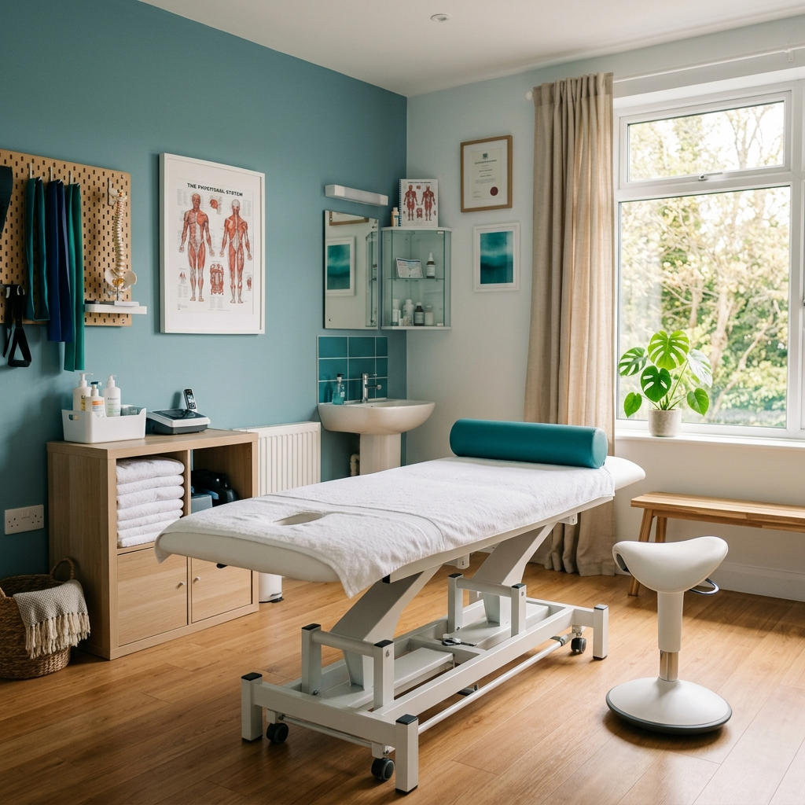

# Astra Health - Home Page Content

## Page Information
- **Title:** Healthcare Clinic in Ashford, Kent – Astra Health
- **URL:** index.html

## Hero Section
- **Heading:** YOUR #1 HEALTHCARE PARTNERS.
- **Sub-heading:** Astra Health is a healthcare clinic located in the heart of Kent.
- **Primary Action:** Our services
- **Secondary Action:** Get in touch

### Images
- 
- 
- 

## Our Commitment: The Pillars of Astra
- **Experienced:** With over two decades of experience, we have collectively helped and treated hundreds of happy patients.
- **Friendly:** We are a warm team of physiotherapists and experts dedicated to your health and wellbeing.
- **Caring:** Our number one priority is for our patients to leave our clinic feeling cared for. You're in the right hands.

### Images
- 
- 
- 

## Our Philosophy: Healthcare with Integrity
- **Content:** The Astra Health clinic is committed to being the most trusted provider of healthcare through our highly trained team of experts and advanced facilities.
- **Action:** Get in touch

### Images
- 

## Our Services
### Diagnostics
- MSK Assessment
- Post-natal check
### Advanced Therapy
- Shockwave Therapy
- Joint injections
### Specialized Care
- Women's Health
- Manual Therapy

## Our Wonderful Team (Featured)
### Sumin Moses - The Specialist
- **Role:** Specialist MSK Physiotherapist
- **Experience:** 15+ Years
- **Bio:** A highly experienced and compassionate specialist MSK physiotherapist with a deep passion for clinical excellence.
- **Expertise:** MSK Assessment, Joint Injections, Shockwave Therapy.
- **Philosophy:** Evidence-based, Patient-centric, Holistic Care.
- 

### Ruth Jayakaran - The Director
- **Role:** Director and Senior Physiotherapist
- **Experience:** 20+ Years
- **Bio:** Director and Senior Physiotherapist with a special interest in women's health and clinical wellness strategies.
- **Focus:** Women's Health, Pelvic Health, Clinical Strategy.
- **Experience Detail:** 20+ Years Practice, Clinical Leadership, Advanced Education.
- 

## Contact & Info
- **Address:** 11 Repton Avenue, Ashford, Kent, TN23 3RX
- **Phone:** 01233 631 555
- **Maps:** View on Google Maps

## Professional Partners
- WPA
- PruHealth
- Cigna
- AVIVA
- Simplyhealth
- NHS

## Footer
- **Slogan:** Defining the gold standard in physical healthcare and patient-centric clinical excellence.
- **Clinic Hours:**
  - Mon — Fri: 08:00 - 20:00
  - Sat: 09:00 - 14:00
  - Sun: Closed
- **Copyright:** © Astra Health. Designed By Bten.in
