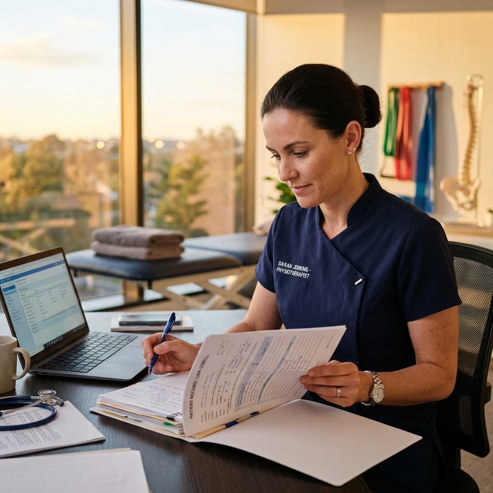

# Astra Health - Our Team Content

## Page Information
- **Title:** Our Team | Astra Health Clinic
- **URL:** team.html

## Hero Section
- **Heading:** Meet our Team
- **Sub-heading:** Our team of highly trained experts is dedicated to your wellbeing.

## Team Members

### Sumin Moses
- **Role:** Specialist MSK Physiotherapist
- **Bio:** Sumin is a highly experienced and compassionate physiotherapist with a deep passion for treating musculoskeletal conditions.
- 

### Ruth Jayakaran
- **Role:** Director and Senior Physiotherapist
- **Bio:** Ruth has over 15 years of experience and a special interest in women's health and wellness, dedicated to exceptional patient care.
- 

### Litto Thomas
- **Role:** Physiotherapist
- **Bio:** Litto has over 10 years experience as a physiotherapist. He is passionate about helping patients recover and regain their strength.
-  (Note: Image may be missing from source)

### Hirna Raje
- **Role:** Physiotherapist
- **Bio:** Hirna has over 10 years experience as a physiotherapist and holds a Masters Degree.
- 

### Haripriya Krishnamurthy
- **Role:** Physiotherapist
- **Bio:** Haripriya is an experienced physiotherapist with a Master's degree from the University of Nottingham.
- 

### Fizzah Lutufullah
- **Role:** Senior Administrator
- **Bio:** Fizzah is our long standing and dedicated Senior Administrator, ensuring the clinic runs smoothly.
- 

### Tincy Mookkanolil
- **Role:** Administrator
- **Bio:** Tincy is an experienced administrator with a Masters in Business Administration (MBA).
- 
